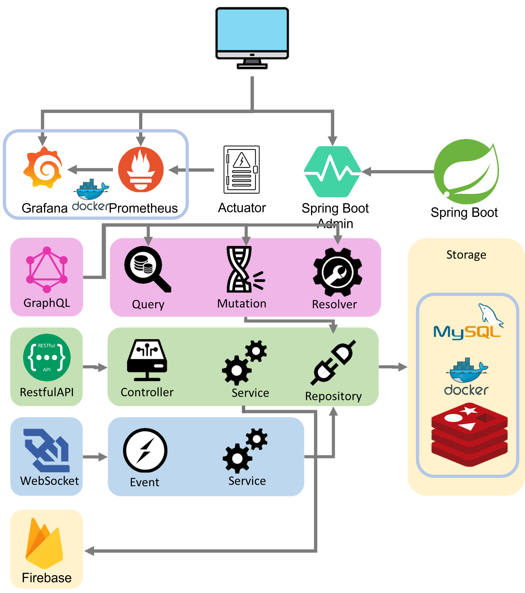

<span style="text-align: center">

# Garbage Classifier Backend


</span>

----

### Swagger Document Link

[Local Web Interface Page SwaggerUI](http://localhost:8080/swagger-ui/index.html)

[Remote Web Interface Page SwaggerUI](http://140.125.207.230:8080/swagger-ui/index.html)

----

### Structure of Project

> Involve Application Frontend Backend Hardware

[Application Project](https://github.com/lavender0526/Garbage_Classifier_App)

[Frontend Project](https://github.com/fan9704/Garbage_Classifier_Frontend)

[Backend Project](https://github.com/fan9704/Garbage_Classifier_Backend_New)

[Hardware Project](https://github.com/fan9704/Garbage_Classifier_Hardware)

----

### Software Technical Architecture




----


----

### Feature

#### Account Management

> Through frontend or application to register their account and auto generate their virtual wallet

#### Transfer Money

> Through application transfer their recycle balance from virtual wallet to bank account

#### Auto Sorting Recycling

> Put the recycling on the machine through YOLOv7 recognize the recycling type
> Then according the recycling unit price and weight feedback money to user
> Notify related recycling company clean up the recycling can

#### Realtime Monitor Recycling Can Storage

> User and Manager can through frontend and application realtime monitor any recycling machine status

#### Active Notification 

> When the recycling can approximately full system will activate notify to manager

----

### Web Interface Detail
#### User
- User Register Post:/api/register
- User Login Post:/api/login
- User ChangePassword Put:/api/changePassword
- User GetUserInfoByUsername Get:/api/userinfo/{username}
- User EditUserInfo Put:/api/EditUserInfo
- Check UserLoginStatus /Get:/api/checkLogin
- User Logout /Get:/api/logout
- **Register Api Will auto create user wallet and account**
#### Wallet
- Get WalletValueByUsername Get:/api/walletValue/{username}
- List WalletInfoByUsername Get:/api/walletInfo/{username}
- Create WalletRecord Post:/api/wallet
#### Machine
- Get All Machines By Location Get:/api/machines/location?location={location}
- Link User Machine Patch:/api/machine/{machineId}/link/{userId}
- UnLink User Machine Patch:/api/machine/{machineId}/unlink
- Lock Machine Patch:/machine/lock/{machineId}
- Unlock Machine Patch:/machine/unlock/{machineId}
- Update Recycle Record Patch:/api/machine/{machineId}
- **Create Machine Will Auto Create Any Garbage Type Of Machine Storage Data**
#### MachineStorage
- Update MachineStorage Patch:/api/machine_storage
- Read MachineStorage By Machine Get:/api/machine_storage/machine/{ID}
- Read MachineStorage By GarbageType Get:/api/machine_storage/garbage_type/{ID}
#### BankAcct
- Read BankAccount By Username Get:/api/back_acct/username/{username}
- Update User BankAccount Patch:/api/bank_acct/user
#### Every API Feature
- Create something Post:/api/something
- Read something By ID  GET:/api/something/{ID}
- Update something Put:/api/something/{ID}
- Delete something Delete:/api/something/{ID}
- Read all something GET:/api/somethings
- Update piece of something Patch:/api/something/{ID}

----

## Run Spring Boot application
```
mvn spring-boot:run
```

## shutdown through bash
```
 sudo lsof -i :8080 | grep LISTEN
 kill <PID>
```

